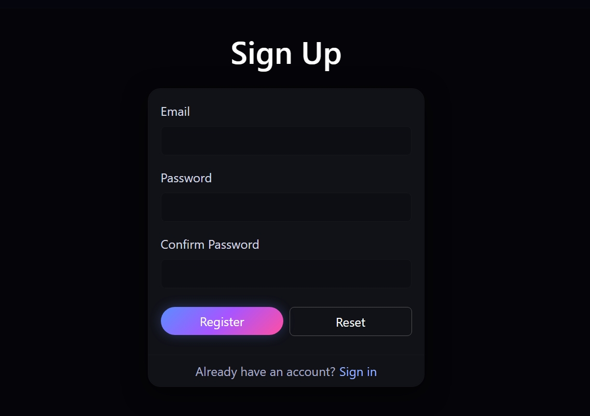
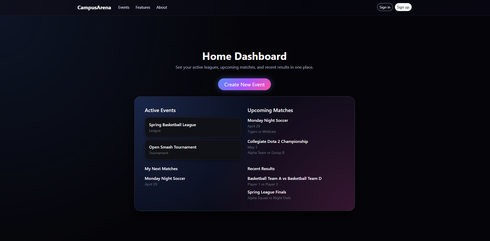
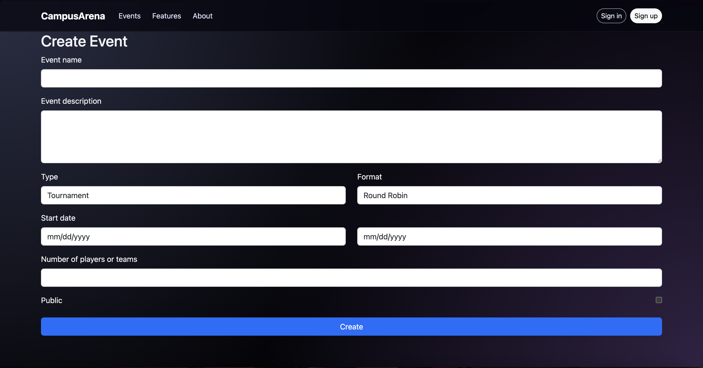
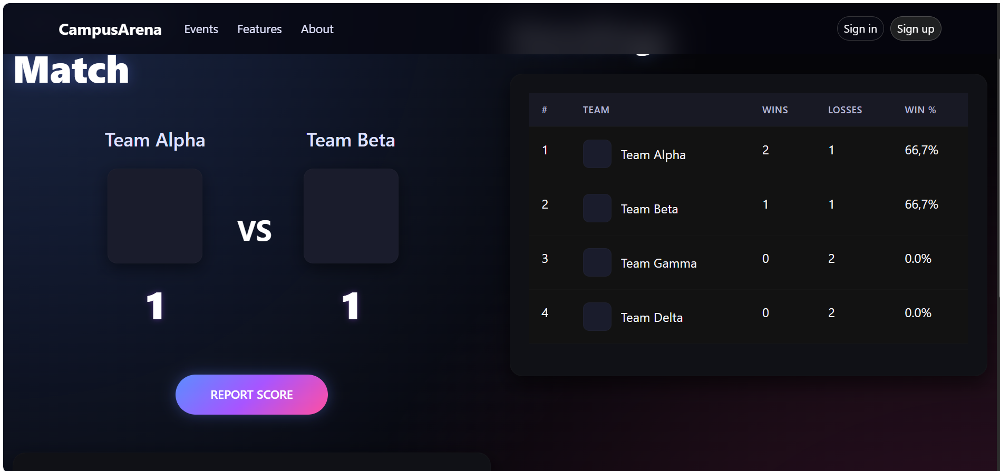

# CampusArena

📌 **[GitHub Organization](https://github.com/campusarena)**

📄 **[Team Contract](https://docs.google.com/document/d/1myrrUoQkdv6lsjwyFxRFWcjMTkhilMW4fPg73qIhYT0/edit?tab=t.0)**

📄 **[Milestone 1 Project Board](https://github.com/orgs/campusarena/projects/1)**

📄 **[Milestone 2 Project Board](https://github.com/orgs/campusarena/projects/2)**

## Table of contents

* [Overview](#overview)
* [Deployment](#deployment)
* [User Guide](#user-guide)
* [Community Feedback](#community-feedback)
* [Developer Guide](#developer-guide)
* [Development History](#development-history)
* [Continuous Integration](#continuous-integration)
* [Walkthrough videos](#walkthrough-videos)
* [Example enhancements](#example-enhancements)
* [Team](#team)

---

## Overview

**CampusArena** is a UH Mānoa–focused web application that allows students to easily create and participate in **recreational leagues and tournaments** for both sports and esports.

Instead of organizing through Discord chats or spreadsheets, users can create tournament or league groups directly on the site, invite participants, and manage standings, schedules, and match results in one place.

CampusArena illustrates technologies and design patterns useful to ICS software engineering students, including:

* **Next.js** for server-side rendering, routing, and project structure.
* **React** for building modular, component-based UIs.
* **React Bootstrap** for responsive styling.
* **PostgreSQL** for relational data storage and efficient querying.

It also demonstrates several important concepts:

* Event creation and management through **user-generated groups**.
* Multiple competition formats such as **round robin**, **double elimination**, and **Swiss**.
* Support for both **short-term tournaments** and **seasonal league play**.
* User authentication handled internally by CampusArena (no UH credentials required).
* Role-based functionality for participants, organizers, and administrators.

---

## Deployment

CampusArena is built with **Next.js** and can be deployed on **Vercel**, **Render**, or any Node-based host connected to **PostgreSQL**.

For this documentation site, GitHub Pages will serve the Markdown-based project overview.  
The live web application can be linked here once deployed.

 **[CampusArena Vercel](https://campusarena.vercel.app/match)**  
 
---

## User Guide

This section outlines the main pages and interactions in CampusArena.

### Landing Page

The landing page welcomes users and shows current public tournaments and leagues available to join.

<div style="display: flex; gap: 10px; justify-content: center;">
  
  
</div>

### Sign In and Sign Up

Users can register with an email and password or sign in to their existing account.  
CampusArena manages its own accounts; UH authentication is **not** required.

<div style="display: flex; gap: 10px;">
  
  
</div>

### Home Dashboard

After signing in, users are taken to their personal dashboard showing:

* Active tournaments or leagues they’ve joined  
* Upcoming matches and recent results  
* Options to create new events or join existing ones



### Create Event Page

Users can create new **tournament** or **seasonal league** groups by specifying:

* Event name and description  
* Format (round robin, double elimination, Swiss, ranked ladder, etc.)  
* Start and end dates  
* Number of players or teams  

Once created, others can join the event through a simple link or join code.




### Match Page

Displays match details including participants, scores, and scheduled time.  
After the match concludes, results can be submitted and verified by the opponent or organizer.




### Standings Page

Shows the leaderboard or bracket depending on event type.  
Leagues display win/loss records and custom MMR-based rankings, while tournaments show bracket progression.


---

## Community Feedback

We welcome feedback and suggestions from students and participants.  
A feedback form link will be added once the initial deployment is live.

---

## Developer Guide

This section describes how to set up and run CampusArena for development.

### Installation

Clone the repository and install dependencies:

```
npm install
```

Set up a local PostgreSQL database and configure your `.env` file with the database URL and secret keys.  
Then run the development server with:

```
npm run dev
```

If successful, the site will be available at [http://localhost:3000](http://localhost:3000).

### Application Design

CampusArena uses a modular Next.js structure:

* **/app** – Next.js routes and page components  
* **/components** – shared React components (forms, layouts, UI widgets)  
* **/lib** – database helpers and utilities  
* **/styles** – CSS and Bootstrap overrides  

Key design ideas:

* Clean separation between **events**, **matches**, and **results**.  
* Organizer-controlled event creation, participant management, and score verification.  
* Extensible data model to support both sports and esports events.

### Data Model (overview)

CampusArena uses a relational schema in PostgreSQL including:

* **Users** – participants and organizers  
* **Events** – tournaments or seasonal leagues  
* **Matches** – scheduled pairings and results  
* **Participants** – linking users to events  
* **Ratings** – MMR and statistical summaries for leagues

---

## Development History

CampusArena follows **issue-driven project management** practices:

* Each feature or fix is tracked as a **GitHub Issue**.  
* Work is organized into **milestones** (Mockup → MVP → Feature Expansion).  
* Issues are managed through a **GitHub Project Board**.  
* Branch names follow the pattern `issue-XX-description`, merged via pull request upon completion.

Milestone summaries and links to project boards will be added here as the project progresses.

---

## Continuous Integration

GitHub Actions automatically runs build and lint checks on each push to the main branch.  
The configuration file is located at `.github/workflows/ci.yml`.

---

## Walkthrough videos

Walkthrough videos will be published as development progresses, including:

* Creating a tournament  
* Joining and managing a league  
* Submitting and verifying match results  
* Viewing standings and rankings  

---

## Example enhancements

Future improvements and experimental ideas include:

* Optional schedule optimization using availability data  
* Highlight reels or VOD storage for completed matches  
* Cross-event MMR tracking across multiple tournaments  
* In-app messaging or notifications for match reminders  
* Administrative tools for event moderation and dispute handling  

---

## Team

CampusArena is developed by UH Mānoa ICS students as part of a software engineering course project.  
Ian Ohari, Mariah Tuquero, Alfred Agbayani, David King, Noah Oya, Rae Vance

---
